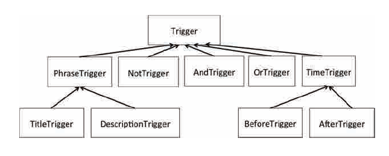

# Problem Set 5

## Introduction

You will use object-oriented programming (classes and inheritance) to build a program to monitor news feeds over the Internet. Your program will filter the news, alerting the user when it notices a news story that matches that user's interests (for example, the user may be interested in a notification whenever a story related to the Red Sox is posted).

This problem set does not require many lines of code! We recommend that the solutions you write for each problem stay under about 15-20 lines of code (the solutions for some problems will be much shorter than that).

Here is the official Python tutorial on classes, sections 9.1-9.7 (except for 9.5.1) will be useful for this pset.

## Getting Started

### Download and save

pset5.zip: A zip file of all the files you need, including:

- ps5.py, a skeleton for you to fill in
- ps5_test.py, a test suite that will help you check your answers
- triggers.txt, a trigger configuration file
- feedparser.py, a module that will retrieve and parse feeds for you
- project_util.py, a module that converts simple HTML fragments to plain text
- mtTkinter.py, a module that handles graphic interface

The three modules (feedparser.py, project_util.py, mtTkinter.py) are necessary for this problem set to work, but you will not need to modify or understand them.

# RSS Feed Filter

## RSS Overview

News sites, such as Google News , have content that is updated on an unpredictable schedule. One tedious way to keep track of this changing content is to load the website up in your browser and periodically hit the refresh button.

Fortunately, this process can be streamlined and automated by connecting to the website's RSS feed, using an RSS feed reader instead of a web browser. An RSS reader (e.g. Sage) will periodically collect and draw your attention to updated content.

RSS stands for " Really Simple Syndication." An RSS feed consists of (periodically changing) data stored in an XML-format file residing on a web-server. For this problem set, the details are unimportant. You don't need to know what XML is, nor do you need to know how to access these files over the network. We have taken care of retrieving and parsing the XML file for you.

## Data Structure Design

### RSS Feed Structure: Google News

First, let's talk about one specific RSS feed: Google News. The URL for the Google News feed is: http://news.google.com/?output=rss

If you try to load this URL in your browser, you'll probably see your browser's interpretation of the XML code generated by the feed. You can view the XML source with your browser's "View Page Source" function, though it probably will not make much sense to you. Abstractly, whenever you connect to the Google News RSS feed, you receive a list of items . Each entry in this list represents a single news item . In a Google News feed, every entry has the following fields:

- guid : A globally unique identifier for this news story.
- title : The news story's headline.
- description : A paragraph or so summarizing the news story.
- link : A link to a website with the entire story.
- pubDate : Date the news was published
- category : News category, such as “Top Stories”

### Generalizing the Problem

This is a little trickier than we'd like it to be, because each of these RSS feeds is structured a little bit differently than the others. So, our goal is to come up with a unified, standard representation that we'll use to store a news story.

We want to do this because we want an application that aggregates several RSS feeds from various sources and can act on all of them in the exact same way. We should be able to read news stories from various RSS feeds all in one place.

✦✦✦✦

#### Problem 1

Parsing (see below for a definition) all of this information from the feeds that Google/Yahoo/etc. gives us is no small feat. So, let's tackle an easy part of the problem first. Pretend that someone has already done the specific parsing, and has left you with variables that contain the following information for a news story:

- globally unique identifier (GUID) - a string
- title - a string
- description - a string
- link to more content - a string
- pubdate - a datetime

We want to store this information in an object that we can then pass around in the rest of our program. Your task, in this problem, is to write a class, NewsStory, starting with a constructor that takes ( guid, title, description, link, pubdate ) as arguments and stores them appropriately. NewsStory also needs to contain the following methods:

- get_guid(self)
- get_title(self)
- get_description(self)
- get_link(self)
- get_pubdate(self)

The solution to this problem should be relatively short and very straightforward (please review what get methods should do if you find yourself writing multiple lines of code for each). Once you have implemented NewsStory all the NewsStory test cases should work.

✦✦✦✦

### Parsing the Feed

Parsing is the process of turning a data stream into a structured format that is more convenient to work with. We have provided you with code that will retrieve and parse the Google and Yahoo news feeds.

## Triggers

Given a set of news stories, your program will generate alerts for a subset of those stories. Stories with alerts will be displayed to the user, and the other stories will be silently discarded. We will represent alerting rules as triggers. A trigger is a rule that is evaluated over a single news story and may fire to generate an alert. For example, a simple trigger could fire for every news story whose title contained the phrase "Microsoft Office". Another trigger may be set up to fire for all news stories where the description contained the phrase "Boston". Finally, a more specific trigger could be set up to fire only when a news story contained both the phrases "Microsoft Office" and "Boston" in the description.

In order to simplify our code, we will use object polymorphism. We will define a trigger interface and then implement a number of different classes that implement that trigger interface in different ways.

### Trigger Interface

Each trigger class you define should implement the following interface, either directly or transitively. It must implement the evaluate method that takes a news item ( NewsStory object)as an input and returns True if an alert should be generated for that item. We will not directly use the implementation of the Trigger class, which is why it raises an exception should anyone attempt to use it.

The class below implements the Trigger interface (you will not modify this). Any subclass that inherits from it will have an evaluate method. By default, they will use the evaluate method in Trigger, the superclass, unless they define their own evaluate function, which would then be used instead. If some subclass neglects to define its own evaluate() method, calls to it will go to Trigger.evaluate(), which fails (albeit cleanly) with the NotImplementedError:

```python
class Trigger(object):
  def evaluate(self, story):
    """Returns True if an alert should be generated
    for the given news item, or False otherwise."""
    raise NotImplementedError
```

We will define a number of classes that inherit from Trigger. In the figure below, Trigger is a superclass, from which all other classes inherit. The arrow from PhraseTrigger to Trigger means that PhraseTrigger inherits from Trigger - a PhraseTrigger is a Trigger. Note that other classes inherit from PhraseTrigger.



### Phrase Triggers

Having a trigger that always fires isn't interesting; let's write some that are interesting! A user may want to be alerted about news items that contain specific phrases. For instance, a simple trigger could fire for every news item whose title contains the phrase "Microsoft Office". In the following problems, you will create a phrase trigger abstract class and implement two classes that implement this phrase trigger.

A phrase is one or more words separated by a single space between the words. You may assume that a phrase does not contain any punctuation. Here are some examples of valid phrases:

- 'purple cow'
- 'PURPLE COW'
- 'mOoOoOoO'
- 'this is a phrase'

But these are NOT valid phrases:

- 'purple cow???' (contains punctuation)
- 'purple &nbsp;&nbsp;&nbsp;&nbsp;cow' (contains multiple spaces between words)

Given some text, the trigger should fire only when each word in the phrase is present in its entirety and appears consecutively in the text, separated only by spaces or punctuation. The trigger should not be case sensitive. For example, a phrase trigger with the phrase "purple cow" should fire on the following text snippets:

- 'PURPLE COW'
- 'The purple cow is soft and cuddly.'
- 'The farmer owns a really PURPLE cow.'
- 'Purple!!! Cow!!!'
- 'purple@#$%cow'
- 'Did you see a purple cow?'

But it should not fire on these text snippets:

- 'Purple cows are cool!'
- 'The purple blob over there is a cow.'
- 'How now brown cow.'
- 'Cow!!! Purple!!!'
- 'purplecowpurplecowpurplecow'

Dealing with exclamation marks and other punctuation that appear in the middle of the phrase is a little tricky. For the purpose of your parsing, pretend that a space or any character in string.punctuation is a word separator. If you've never seen string.punctuation before, go to the Python shell and type:

```python
import string
print(string.punctuation)
```

Play around with this a bit to get comfortable with what it is. The split, replace, join, methods of strings will almost certainly be helpful as you tackle this part.

You may also find the string methods lower and/or upper useful for this problem.

✦✦✦✦

#### Problem 2

Implement a phrase trigger abstract class, PhraseTrigger. It should take in a string phrase as an argument to the class's constructor. This trigger should not be case-sensitive (it should treat "Intel" and "intel" as being equal).

PhraseTrigger should be a subclass of Trigger. It has one new method, is_phrase_in, which takes in one string argument text. It returns True if the whole phrase is present in text, False otherwise, as described in the above examples. This method should not be case-sensitive. Implement this method.

Because this is an abstract class, we will not be directly instantiating any PhraseTriggers. PhraseTrigger should inherit its evaluate method from Trigger. We do this because now we can create subclasses of PhraseTrigger that use its is_phrase_in function.

✦✦✦✦

You are now ready to implement PhraseTrigger's two subclasses: TitleTrigger and DescriptionTrigger .

✦✦✦✦

#### Problem 3

Implement a phrase trigger subclass, TitleTrigger that fires when a news item's titlecontains a given phrase. For example, an instance of this type of trigger could be used to generate an alert whenever the phrase "Intel processors" occurred in the title of a news item.

As it was in PhaseTrigger, the phrase should be an argument to the class's constructor,and the trigger should not be case-sensitive.

Think carefully about what methods should be defined in TitleTrigger and whatmethods should be inherited from the superclass. Once you've implemented TitleTrigger , the TitleTrigger unit tests in our test suite should pass. Remember thatall subclasses that inherit from the Trigger interface should include a working evaluate method.

If you find that you're not passing the unit tests, keep in mind that FAIL means your code runs but produces the wrong answer, whereas ERROR means that your code crashes due to some error.

✦✦✦✦

#### Problem 4

Implement a phrase trigger subclass, DescriptionTrigger , that fires when a news item'sdescription contains a given phrase. As it was in PhaseTrigger , the phrase should bean argument to the class's constructor, and the trigger should not be case-sensitive.

Once you've implemented DescriptionTrigger , the DescriptionTrigger unit tests in our test suite should pass.

✦✦✦✦

### Time Triggers

Let’s move on from PhraseTrigger. Now we want to have triggers that is based on whenthe NewsStory was published, not on its news content. Please check the earlier diagram ifyou’re confused about the inheritance structure of the Triggers in this problem set.

#### Problem 5

Implement a time trigger abstract class, TimeTrigger , that is a subclass of Trigger . The class's constructor should take in time in EST as a string in the format of "3 Oct 2016 17:00:10 ". Make sure to convert time from string to a datetime before saving it as an attribute. Some of datetime ’s methods, strptime and replace , along with an explanation of the string format for time, might come in handy. You can also look at the provided code in process to check. You do not have to implement any other methods.

Because this is an abstract class, we will not be directly instantiating any TimeTrigger.

✦✦✦✦

#### Problem 6

Implement BeforeTrigger and AfterTrigger , two subclasses of TimeTrigger .BeforeTrigger fires when a story is published strictly before the trigger’s time, andAfterTrigger fires when a story is published strictly after the trigger’s time. Theirevaluate should not take more than a couple of lines of code.

Once you've implemented BeforeTrigger and AfterTrigger , theBeforeAndAfterTrigger unit tests in our test suite should pass.

✦✦✦✦

### Composite Triggers

So the triggers above are mildly interesting, but we want to do better: we want to 'compose' the earlier triggers to set up more powerful alert rules. For instance, we may want to raise an alert only when both "google glass" and "stock" were present in the news item (an idea wecan't express with just phrase triggers).

Note that these triggers are not phrase triggers and should not be subclasses of PhraseTrigger . Again, please refer back to the earlier diagram if you’re confused about the inheritance structure of Trigger.

✦✦✦✦

#### Problem 7

Implement a NOT trigger (NotTrigger).

This trigger should produce its output by inverting the output of another trigger. The NOT trigger should take this other trigger as an argument to its constructor (why its constructor? Because we can't change what parameters evaluate takes in... that'd break our polymorphism). So, given a trigger T and a news item x , the output of the NOT trigger'sevaluate method should be equivalent to not T.evaluate(x).

When this is done, the NotTrigger unit tests should pass.

✦✦✦✦

#### Problem 8

Implement an AND trigger ( AndTrigger ).

This trigger should take two triggers as arguments to its constructor, and should fire on a news story only if both of the inputted triggers would fire on that item.

When this is done, the AndTrigger unit tests should pass.

✦✦✦✦

#### Problem 9

Implement an OR trigger ( OrTrigger ).

This trigger should take two triggers as arguments to its constructor, and should fire if either one (or both) of its inputted triggers would fire on that item.

When this is done, the OrTrigger unit tests should pass.

✦✦✦✦

## Filtering

At this point, you can run ps5.py, and it will fetch and display Google and Yahoo news items for in a pop-up window. How many news items? All of them.

Right now, the code we've given you in ps5.py gets the news from both feeds every minute and displays the result. This is nice, but, remember, the goal here was to filter out only the the stories we wanted.

✦✦✦✦

#### Problem 10

Write a function, filter_stories(stories, triggerlist) that takes in a list of newsstories and a list of triggers, and returns a list of only the stories for which a trigger fires.

After completing Problem 10, you can try running ps5.py, and various RSS news items should pop up, filtered by some hard-coded triggers defined for you in code near the bottom. You may need to change these triggers to reflect what is currently in the news. The code runs an infinite loop, checking the RSS feeds for new stories every 120 seconds.

✦✦✦✦

## User-Specified Triggers

Right now, your triggers are specified in your Python code, and to change them, you have to edit your program. This is very user-unfriendly. (Imagine if you had to edit the source code of your web browser every time you wanted to add a bookmark!)

Instead, we want you to read your trigger configuration from a triggers.txt file every timeyour application starts and use the triggers specified there.

Consider the following example configuration file:

// description trigger named t1
t1,DESCRIPTION,Presidential Election

// title trigger named t2
t2,TITLE,Hillary Clinton

// description trigger named t3
t3,DESCRIPTION,Donald Trump

// composite trigger named t4
t4,AND,t2,t3

// the trigger list contains t1 and t4
ADD,t1,t4The

The example file specifies that four triggers should be created, and that two of those triggers should be added to the trigger list:

- A trigger that fires when the description contains the phrase 'PresidentialElection' ( t1 ).
- A trigger that fires when the title contains the description Donald Trump and the titlecontains the phrase Hillary Clinton ( t4 ).

The two other triggers ( t2 and t3 ) are created but not added to the trigger list directly. They areused as arguments for the composite AND trigger's definition ( t4 ).

Each line in this file does one of the following:

- is blank
- is a comment (begins with // with no spaces preceding the // )
- defines a named trigger
- adds triggers to the trigger list

Each type of line is described below.

Blank: blank lines are ignored. A line that consists only of whitespace is a blank line.

Comments: Any line that begins with // is ignored.

Trigger definitions: Lines that do not begin with the keyword ADD define named triggers. Elements in these lines are separated by commas . The first element in a trigger definition is either the keyword ADD or the name of the trigger. The name can be any combination of letters/numbers, but it cannot be the word "ADD". The second element of a trigger definition is a keyword (e.g., TITLE, AND, etc.) that specifies the type of trigger being defined. The remaining elements of the definition are the trigger arguments. What arguments are required depends on the trigger type:

- TITLE : one phrase
- DESCRIPTION : one phrase
- AFTER : one correctly formatted time string
- BEFORE : one correctly formatted time string
- NOT : the name of the trigger that will be NOT'd
- AND : the names of the two triggers that will be AND'd.
- OR : the names of the two triggers that will be OR'd.

Trigger addition: A trigger definition should create a trigger and associate it with a name but should NOT automatically add that trigger to the trigger list. One or more ADD lines in the trigger configuration file will specify which triggers should be in the trigger list. An ADD line begins with the ADD keyword. The elements following ADD are the names of one or more previously defined triggers. The elements in these lines are also separated by commas. These triggers will be added to the the trigger list.

✦✦✦✦

#### Problem 11

Finish implementing read_trigger_config(filename) . We've written code to open thefile and throw away all blank lines and comments. Your job is to finish the implementation. read_trigger_config should return a list of triggers specified by the configuration file.

Hint: Feel free to define a helper function if you wish! Using a helper function is not required though.

Hint: You will probably find it helpful to use a dictionary where the keys are trigger names.

Once that's done, modify the code within the function main_thread to use the trigger list specified in your configuration file, instead of the one we hard-coded for you:

```python
# TODO: Problem 11
# After implementing read_trigger_config, uncomment this line:
# triggerlist = read_trigger_config('triggers.txt')
```

After completing Problem 11, you can try running ps5.py , and depending on yourtriggers.txt file, various RSS news items should pop up. The code runs an infinite loop,checking the RSS feed for new stories every 120 seconds.

Hint: If no stories are popping up, open up triggers.txt and change the triggers to onesthat reflect current events (if you don't keep up with the news, just pick some triggers that would fire on the current Google News
stories).

✦✦✦✦

#### Problem 12

Think about the presidential debate coming up on October 19th, and write debate_triggers.txt so that you can get news that is published within the +/- 3 hourwindow of the debate!

✦✦✦✦

### This completes the problem set!
